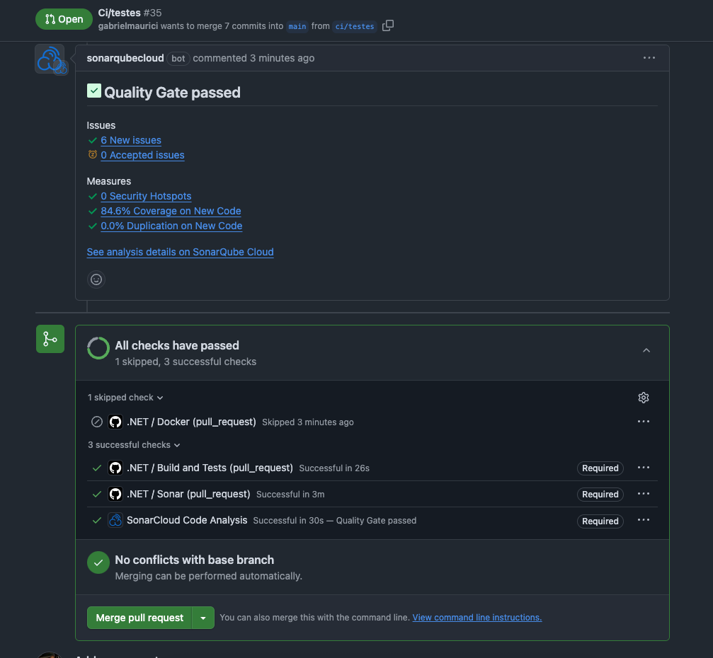

# ci-pipeline-dotnet
Exemplo de pipeline CI com .NET, utilizando GitHub Actions para automação de build, testes e validações.

## 🛠️ Construído com
* [.NET](https://dotnet.microsoft.com/) - Usado para desenvolvimento da API e testes de unidade
* [GitHub Actions](https://github.com/features/actions) - Usado para orquestração da pipeline CI
* [SonarCloud](https://sonarcloud.io/) - Usado para análise de qualidade e cobertura de testes
* [Docker](https://www.docker.com/) - Usado para construção e publicação da imagem da API
* [DockerHub](https://hub.docker.com/) - Usado para hospedagem da imagem Docker gerada

## 🧩 Como funciona a pipeline

A pipeline de CI no GitHub Actions executa as seguintes etapas:
1. Restaura dependências, builda e roda os testes.
2. Realiza a análise de qualidade e cobertura com o SonarCloud.
3. Constrói a imagem Docker e publica no repositório docker hub. (Apenas quando o merge da main é realizado com sucesso)

## 🚀 Resultado

### Sucesso na Pipeline
Obs: Ao realizar PR são acionadas apenas as esteiras de build, testes, e sonar. Ao realizar o merge da PR na branch main, é acionado a esteira do sonar novamente, caso aprovada segue para a última esteira de build e push do Docker, se reprovada a esteira do Docker não é iniciada.

